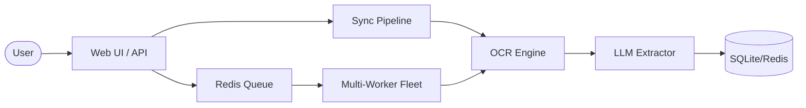
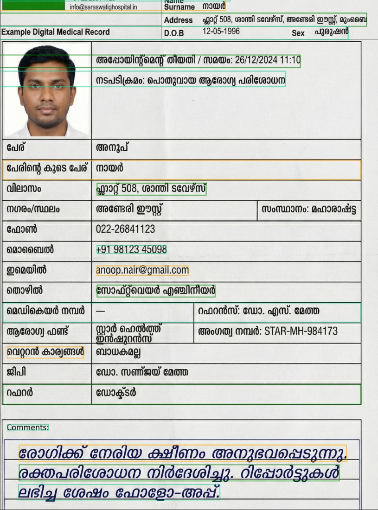

# MedScan AI: Intelligent Medical Document Digitization

[](https://opensource.org/licenses/MIT)
[](https://www.python.org/downloads/release/python-3130/)
[](https://fastapi.tiangolo.com/)

**MedScan AI** is an end-to-end pipeline designed to automate the digitization of handwritten and printed medical documents. Using state-of-the-art OCR models and LLM-powered extraction, MedScan AI converts messy scans into structured, actionable medical records.

Developed for the **YODHA Hackathon**, MedScan AI aims to reduce hospital administration overhead by 80% through zero-downtime automation.

---

## ✨ Key Features

- 🖋️ **Handwritten OCR**: Powered by Microsoft TrOCR for decoding messy medical handwriting.
- 🧠 **LLM-Powered Extraction**: Uses Groq (Qwen 2.5) for intelligent, context-aware key-value extraction.
- 📑 **Layout-Aware**: Anchors data based on document structure (OPD notes, lab reports, prescriptions).
- 🔄 **Async Processing**: Integrated Redis Queue (RQ) for high-concurrency batch processing.
- 🌏 **Multi-Language Support**: Support for English and Malayalam documents.
- 📊 **Verified Merging**: Intelligently merges data from multiple pages or documents.

---

## 🏗️ Architecture

MedScan AI uses a split-worker architecture for scalability.



---

## 📸 Example: Malayalam Document Processing



*MedScan AI successfully extracts Malayalam text (like names and addresses) and English text simultaneously.*

---

## 🚀 Getting Started

Ready to run MedScan AI locally? Follow these quick steps:

1. **Clone & Setup**:
   ```bash
   git clone https://github.com/GowrishankarSMenon/YODHA-HACKATHON.git
   cd YODHA-HACKATHON/backend
   pip install -r requirements.txt
   ```

2. **Configure**:
   Add your `GROQ_API_KEY` to a `.env` file.

3. **Run**:
   ```bash
   python main.py
   ```

**For a full step-by-step guide, see our [Installation Guide](INSTALL.md).**

---

## 📚 Documentation

- [Installation Guide](INSTALL.md)
- [Contributing Guide](CONTRIBUTING.md)
- [API Reference](backend/docs/README.md)
- [Problem & Solutions](backend/docs/PROBLEM_FIXED.md)

---

## 🤝 Contributing

We welcome contributions! Whether it's fixing bugs, adding new document templates, or improving OCR accuracy, feel free to dive in.

Please read our [Contributing Guide](CONTRIBUTING.md) to get started.

---

## ⚖️ License

Distributed under the MIT License. See `LICENSE` for more information.

---

## 👥 Powered By

Team **StrawHats** - Zero-Downtime Hospital Digitization.
