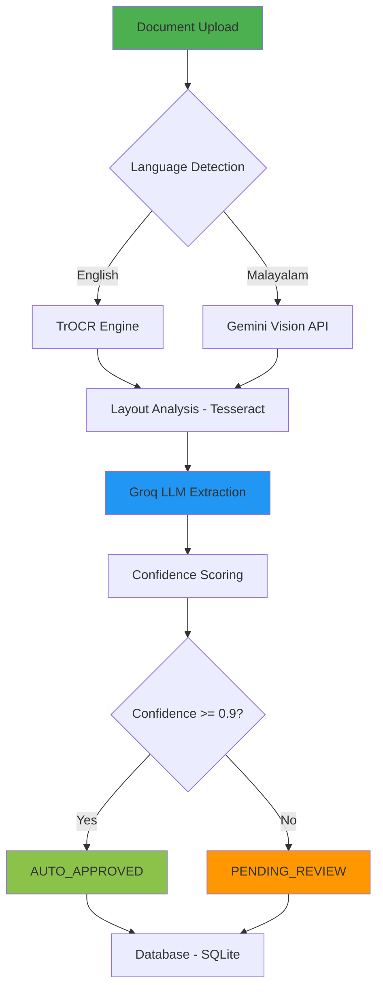

# MedScan AI Backend

> **Intelligent Medical Document Digitization with Multi-Model AI Pipeline**

MedScan AI Backend is a FastAPI-based medical document processing system that combines multiple AI models (OCR, LLM, and custom neural networks) to extract structured data from handwritten and printed medical documents in English and Malayalam.

[⬅️ Back to Project Root](../README.md)

[](https://www.python.org/downloads/)
[](https://fastapi.tiangolo.com/)
[](../LICENSE)

---

## 📋 Table of Contents

- [Features](#-features)
- [Architecture](#-architecture)
- [Models Used](#-models-used)
- [Installation](#-installation)
- [Quick Start](#-quick-start)
- [API Documentation](#-api-documentation)
- [Project Structure](#-project-structure)
- [Related Documentation](#-related-documentation)

---

## ✨ Features

- 🖋️ **Multilingual OCR**: Supports both English (TrOCR) and Malayalam (Gemini Vision + Custom CNN) medical documents
- 🧠 **LLM-Powered Extraction**: Uses Groq (Qwen/Llama) for intelligent key-value pair extraction
- 📊 **Layout-Aware Processing**: Tesseract-based spatial OCR for structured document understanding
- 🔄 **Async Processing**: Redis Queue integration for high-throughput batch processing
- 📈 **Confidence Scoring**: Automatic quality assessment and approval workflow
- 🌐 **Web Interface**: Built-in UI for document upload and extraction visualization

---

## 🏗️ Architecture

MedScan AI uses a multi-stage pipeline with parallel processing support:



### Processing Modes

**Synchronous Mode**: Immediate processing for single documents
```
POST /api/extract-with-template → OCR → LLM → Response
```

**Asynchronous Mode**: Batch processing with Redis Queue
```
POST /upload → Queue → Worker → OCR → LLM → Result
```

---

## 🤖 Models Used

MedScan AI integrates **five distinct AI models** for comprehensive document understanding:

### 1. **Microsoft TrOCR** (Handwritten Text Recognition)
- **Model**: `microsoft/trocr-small-handwritten`
- **Purpose**: Extract text from handwritten English medical documents
- **Type**: Vision Transformer + Text Decoder
- **Implementation**: [`ai/ai_engine.py`](ai/ai_engine.py)

### 2. **Tesseract OCR** (Layout-Aware Text Detection)
- **Version**: Tesseract 5+ (system dependency)
- **Purpose**: Spatial text detection with bounding boxes for layout understanding
- **Type**: Traditional OCR with deep learning
- **Implementation**: [`ai/layoutlmv3_engine.py`](ai/layoutlmv3_engine.py)

### 3. **Groq LLM** (Qwen/Llama)
- **Model**: `llama-3.3-70b-versatile` (default)
- **Purpose**: Intelligent extraction of medical key-value pairs from OCR text
- **Type**: Large Language Model
- **Implementation**: [`ai/groq_service.py`](ai/groq_service.py)
- **API**: Groq Cloud API

### 4. **Google Gemini Vision API** (Malayalam OCR)
- **Model**: `gemini-2.5-flash`
- **Purpose**: OCR for Malayalam/multilingual handwritten medical documents
- **Type**: Multimodal Vision-Language Model
- **Implementation**: [`main.py#L122-L173`](main.py#L122-L173)
- **API**: Google GenAI API

### 5. **Custom Malayalam Character Recognizer** (CNN)
- **Model**: Custom-trained Convolutional Neural Network
- **HuggingFace**: [shankarz/malayalam-character-recognizer](https://huggingface.co/shankarz/malayalam-character-recognizer/tree/main)
- **Purpose**: Character-level recognition for Malayalam language
- **Architecture**: Multi-layer CNN with data augmentation
- **Implementation**: [`malayalam_model/malayalam-character-recognition/`](malayalam_model/malayalam-character-recognition/)
- **Training Data**: ~50+ Malayalam handwritten character classes

**📖 For detailed model documentation, see [MODELS.md](docs/MODELS.md)**

---

## 🚀 Installation

### Prerequisites

- **Python**: 3.8+ (Recommended: 3.13)
- **Tesseract OCR**: System-level installation required
- **Redis** (Optional): For async processing

### Step-by-Step Installation

#### 1. Clone Repository
```bash
git clone https://github.com/GowrishankarSMenon/YODHA-HACKATHON.git
cd YODHA-HACKATHON/backend
```

#### 2. Install Tesseract OCR

**Windows**:
```powershell
# Download installer from: https://github.com/UB-Mannheim/tesseract/wiki
# Or use Chocolatey:
choco install tesseract
```

**Linux**:
```bash
sudo apt-get install tesseract-ocr
```

**macOS**:
```bash
brew install tesseract
```

#### 3. Install Python Dependencies
```bash
pip install -r requirements.txt
```

#### 4. Configure Environment Variables

Create a `.env` file in the `backend` directory:

```bash
# Copy template
cp .env.example .env
```

Edit `.env` with your API keys:
```env
# Groq API for LLM extraction (Required)
GROQ_API_KEY=gsk_your_groq_api_key_here

# Google Gemini API for Malayalam OCR (Optional)
GEMINI_API_KEY=your_gemini_api_key_here

# Configuration
USE_GROQ=true
GROQ_MODEL=llama-3.3-70b-versatile
GROQ_TEMPERATURE=0.1
```

**Get API Keys**:
- Groq: [https://console.groq.com/keys](https://console.groq.com/keys)
- Gemini: [https://aistudio.google.com/app/apikey](https://aistudio.google.com/app/apikey)

#### 5. (Optional) Setup Redis for Async Processing

**Install Redis**:
```bash
# Windows: Use WSL or download from https://redis.io/download
# Linux:
sudo apt-get install redis-server
# macOS:
brew install redis
```

**Start Redis**:
```bash
redis-server
```

**📖 For detailed installation instructions, see [INSTALLATION.md](docs/INSTALLATION.md)**

---

## ⚡ Quick Start

### Start the Server

```bash
python main.py
```

Server will be available at: **http://localhost:8000**

### Start Worker (For Async Processing)

In a separate terminal:
```bash
python worker.py
```

### Test the API

**Upload a document** (`curl` example):
```bash
curl -X POST "http://localhost:8000/api/extract-with-template" \
  -F "file=@prescription.png" \
  -F "is_malayalam=false"
```

**Using the Web Interface**:
1. Open http://localhost:8000
2. Upload a medical document
3. Select language (English/Malayalam)
4. View extracted structured data

---

## 📡 API Documentation

### Core Endpoints

| Endpoint | Method | Description |
|----------|--------|-------------|
| `/` | GET | Web UI for document upload |
| `/health` | GET | System health and model status |
| `/api/extract-with-template` | POST | Synchronous extraction |
| `/api/process-document` | POST | Sync processing + DB save |
| `/upload` | POST | Async queue document |
| `/status/{job_id}` | GET | Check async job status |
| `/result/{job_id}` | GET | Get async job result |

### Example Response

```json
{
  "success": true,
  "extraction_method": "groq",
  "document_type": "OPD_NOTE",
  "extracted_data": {
    "patient_id": "UHID-12345",
    "patient_name": "Anand Kumar",
    "age": "42",
    "diagnosis": "Type 2 Diabetes Mellitus",
    "medications": [...]
  },
  "confidence_score": 0.95,
  "status": "AUTO_APPROVED"
}
```

**📖 For complete API reference, see [docs/README.md](docs/README.md)**

---

## 📁 Project Structure

```
backend/
├── main.py                     # Main FastAPI application
├── worker.py                   # Redis Queue worker
├── requirements.txt            # Python dependencies
├── .env.example                # Environment template
│
├── ai/                         # AI Model Services
│   ├── ai_engine.py            # TrOCR handwritten recognition
│   ├── layoutlmv3_engine.py    # Tesseract layout-aware OCR
│   ├── groq_service.py         # Groq LLM service
│   └── llm_extractor.py        # LLM extraction orchestrator
│
├── models/                     # Pydantic Data Models
│   └── models.py               # MedicalRecord, PatientRecord schemas
│
├── database/                   # Data Persistence
│   └── database.py             # SQLite operations
│
├── malayalam_model/            # Custom Malayalam Recognition
│   └── malayalam-character-recognition/
│       ├── model.keras         # Trained CNN model
│       ├── train.py            # Training script
│       ├── scan.py             # Inference script
│       └── README.md           # Model documentation
│
├── redis_queue_module/         # Async Processing
│   ├── redis_queue.py          # Queue configuration
│   └── README.md               # Queue documentation
│
├── docs/                       # Documentation
│   ├── README.md               # API documentation
│   ├── MODELS.md               # Model details (NEW)
│   ├── INSTALLATION.md         # Installation guide (NEW)
│   ├── GROQ_SETUP.md           # Groq LLM setup
│   ├── QUICK_START.md          # Quick start guide
│   └── PROBLEM_FIXED.md        # Known issues & fixes
│
├── static/                     # Web UI
│   └── index.html              # Upload interface
│
└── uploads/                    # Uploaded documents (auto-created)
```

---

## 📚 Related Documentation

### Setup Guides
- **[Installation Guide](docs/INSTALLATION.md)** - Detailed installation for all platforms
- **[Groq Setup](docs/GROQ_SETUP.md)** - Configure Groq LLM integration
- **[Quick Start](docs/QUICK_START.md)** - Get running in 5 minutes

### Technical Documentation
- **[Models Documentation](docs/MODELS.md)** - Deep dive into all AI models
- **[API Reference](docs/README.md)** - Complete API documentation
- **[Redis Queue](redis_queue_module/README.md)** - Async processing setup
- **[Malayalam Recognition](malayalam_model/malayalam-character-recognition/README.md)** - Custom model training

### Troubleshooting
- **[Problems & Solutions](docs/PROBLEM_FIXED.md)** - Common issues and fixes

---

## 🔧 Configuration

### Model Selection

**English Documents**: Automatically uses TrOCR + Tesseract
```bash
curl -F "file=@english_prescription.png" -F "is_malayalam=false" ...
```

**Malayalam Documents**: Uses Gemini Vision API
```bash
curl -F "file=@malayalam_opd.png" -F "is_malayalam=true" ...
```

### Confidence Thresholds

Modify in `ai/llm_extractor.py`:
```python
AUTO_APPROVED ≥ 0.90   # Ready for production
PENDING_REVIEW ≥ 0.70  # Requires human verification
REJECTED < 0.70        # Low quality extraction
```

---

## 📊 Performance

- **Throughput**: ~10-15 documents/minute (synchronous)
- **Batch Mode**: 100+ documents/hour with worker scaling
- **Accuracy**: 
  - English OCR: ~85-95% (TrOCR)
  - Malayalam OCR: ~75-90% (Gemini Vision)
  - LLM Extraction: ~90-95% (Groq)

---

## 🤝 Contributing

We welcome contributions! Areas of focus:
- Improving OCR accuracy for Malayalam
- Adding support for more Indian languages
- New medical document templates
- Performance optimizations

See the main [Contributing Guide](../CONTRIBUTING.md) for guidelines.

---

## 📜 License

Distributed under the MIT License. See [LICENSE](../LICENSE) for more information.

---

## 🙏 Acknowledgments

- **Microsoft TrOCR** for handwritten text recognition
- **Groq** for ultra-fast LLM inference
- **Google Gemini** for multimodal vision capabilities
- **Tesseract OCR** for layout understanding
- **HuggingFace** for hosting our Malayalam character model

---

**Part of the MedScan AI Project** | Team StrawHats | YODHA Hackathon 2026
