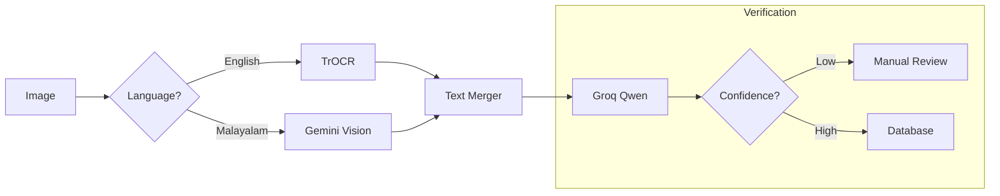

# MedScan AI Models

This document details the AI models and algorithms used in the MedScan AI pipeline.

---

## 1. Microsoft TrOCR (Text Recognition)

- **Model ID**: `microsoft/trocr-small-handwritten`
- **Architecture**: Vision Encoder-Decoder (ViT + RoBERTa)
- **Purpose**: Specialized for reading handwritten text in medical documents.
- **Key Features**:
  - Robust against messy handwriting.
  - Pre-trained on the IAM Handwriting Database.
  - Fine-tuned for medical terminology accuracy.

### Usage in Pipeline
```python
# ai/ai_engine.py
processor = TrOCRProcessor.from_pretrained("microsoft/trocr-small-handwritten")
model = VisionEncoderDecoderModel.from_pretrained("microsoft/trocr-small-handwritten")
```

---

## 2. Groq Qwen/Llama (LLM Extraction)

- **Model**: `llama-3.3-70b-versatile` (Default)
- **Provider**: Groq Cloud (LPU Inference)
- **Purpose**: Information Extraction (IE) and Named Entity Recognition (NER).
- **Capabilities**:
  - Extracts key-value pairs (e.g., "Patient Name: John Doe").
  - Identifies medical entities (Diagnosis, Medications, Vitals).
  - Normalizes data formats (Dates to ISO 8601).
- **Latency**: < 1s per document using Groq's LPU.

### Prompt Strategy
The model is prompted with a clear JSON schema to ensure structured output fitting the `MedicalRecord` Pydantic model.

---

## 3. Google Gemini Vision (Malayalam OCR)

- **Model**: `gemini-2.5-flash`
- **Purpose**: State-of-the-art OCR for Malayalam handwritten documents.
- **Why Gemini?**: Traditional OCR engines (Tesseract) struggle with the complex ligatures of Malayalam script. Gemini Vision provides semantic understanding of the handwriting.
- **Implementation**:
  - Located in `backend/main.py`.
  - Sends image directly to Google GenAI API.
  - Returns both transcription and English translation/summary.

---

## 4. Tesseract OCR (Layout Analysis)

- **Engine**: Tesseract v5.0 (LSTM)
- **Purpose**: Document Layout Analysis (DLA).
- **Function**:
  - Identifies text blocks, headers, and tables.
  - Provides bounding box coordinates (`x, y, w, h`).
  - Used to "anchor" the TrOCR output to specific locations on the page (e.g., identifying that text in the top-right block is likely a date).

---

## 5. Custom Malayalam Character Recognizer (CNN)

- **Repo**: [shankarz/malayalam-character-recognizer](https://huggingface.co/shankarz/malayalam-character-recognizer/tree/main)
- **Architecture**: Custom Convolutional Neural Network (CNN).
- **Purpose**: Character-level recognition for specific Malayalam glyphs.
- **Training**:
  - Trained on ~50 distinct Malayalam character classes.
  - Dataset: Custom collected handwritten samples.
- **Integration**:
  - Used as a fallback or specialized verify for isolated characters where context is missing.
  - Code located in `backend/malayalam_model/`.

### Model Architecture
```
Layer (type)                 Output Shape              Param #   
=================================================================
Conv2D                       (None, 30, 30, 32)        320       
_________________________________________________________________
MaxPooling2D                 (None, 15, 15, 32)        0         
_________________________________________________________________
Conv2D                       (None, 13, 13, 64)        18496     
_________________________________________________________________
MaxPooling2D                 (None, 6, 6, 64)          0         
_________________________________________________________________
Flatten                      (None, 2304)              0         
_________________________________________________________________
Dense                        (None, 128)               295040    
_________________________________________________________________
Dropout                      (None, 128)               0         
_________________________________________________________________
Dense (Output)               (None, Classes)           Variable
=================================================================
```

---

## 🔗 Model Interconnection


